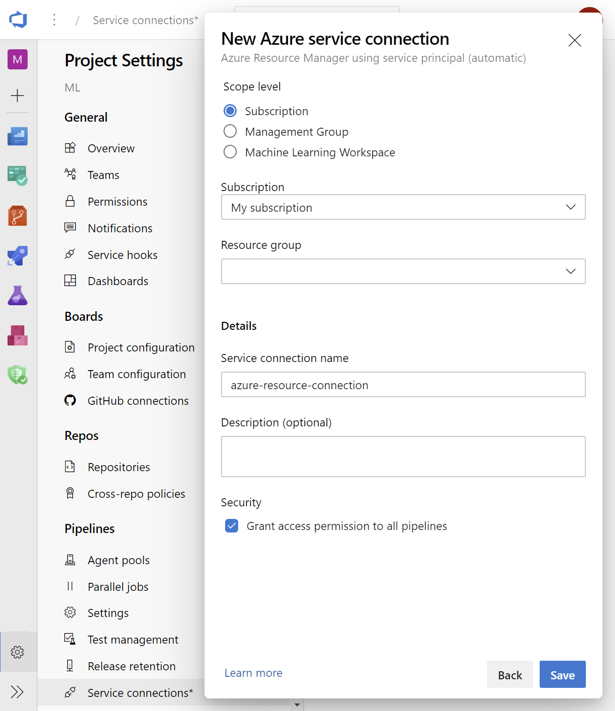
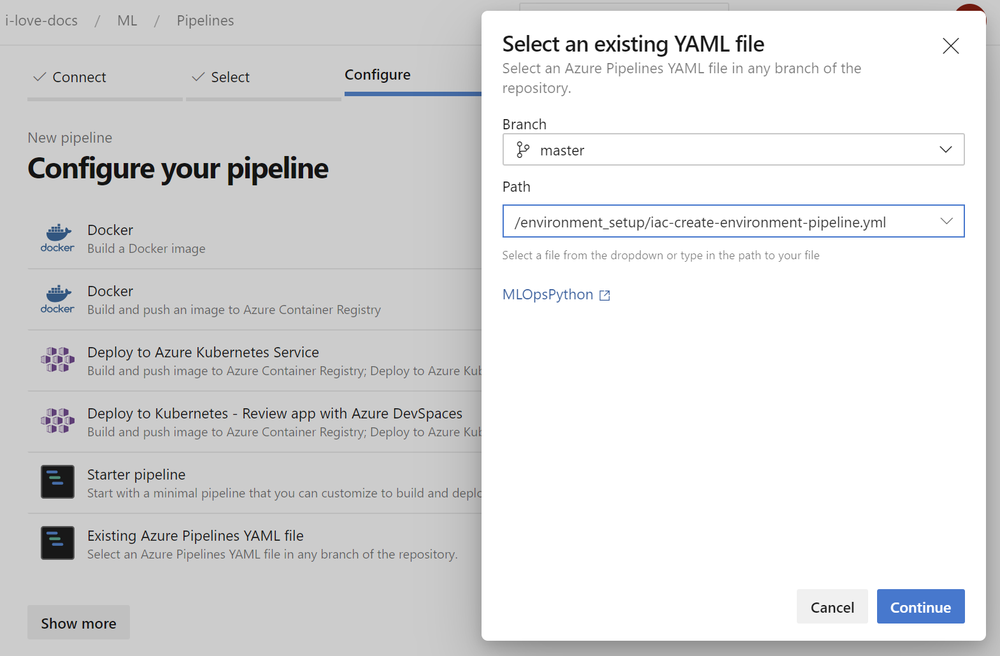
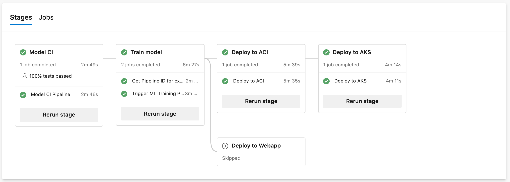

# Getting Started with this Repo

## Clone or fork this repository

## Create an Azure DevOps account

We use Azure DevOps for running our multi-stage pipeline with build(CI), ML training and scoring service release
(CD) stages. If you don't already have an Azure DevOps account, create one by
following the instructions [here](https://docs.microsoft.com/en-us/azure/devops/organizations/accounts/create-organization?view=azure-devops).

If you already have Azure DevOps account, create a [new project](https://docs.microsoft.com/en-us/azure/devops/organizations/projects/create-project?view=azure-devops).

## Create an ARM Service Connection to deploy resources

The repository includes a DevOps pipeline to deploy the Azure ML workspace and associated resources through Azure Resource Manager.

The pipeline requires an **Azure Resource Manager**
[service connection](https://docs.microsoft.com/en-us/azure/devops/pipelines/library/service-endpoints?view=azure-devops&tabs=yaml#create-a-service-connection).
Given this service connection, you will be able to run the IaC pipeline
and have the required permissions to generate resources.

Use **``AzureResourceConnection``** as the connection name, since it is used
in the IaC pipeline definition. Leave the **``Resource Group``** field empty.

**Note:** Creating the ARM service connection scope requires 'Owner' or 'User Access Administrator' permissions on the subscription.
You must also have sufficient permissions to register an application with
your Azure AD tenant, or receive the ID and secret of a service principal
from your Azure AD Administrator. That principal must have 'Contributor'
permissions on the subscription.

## Create a Variable Group for your Pipeline

We make use of variable group inside Azure DevOps to store variables and their
values that we want to make available across multiple pipelines or pipeline stages. You can either
store the values directly in [Azure DevOps](https://docs.microsoft.com/en-us/azure/devops/pipelines/library/variable-groups?view=azure-devops&tabs=designer#create-a-variable-group)
or connect to an Azure Key Vault in your subscription. Please refer to the
documentation [here](https://docs.microsoft.com/en-us/azure/devops/pipelines/library/variable-groups?view=azure-devops&tabs=designer#create-a-variable-group) to
learn more about how to create a variable group and
[link](https://docs.microsoft.com/en-us/azure/devops/pipelines/library/variable-groups?view=azure-devops&tabs=designer#use-a-variable-group) it to your pipeline.
Click on **Library** in the **Pipelines** section as indicated below:

Please name your variable group **``devopsforai-aml-vg``** as we are using this
name within our build yaml file.

The variable group should contain the following required variables:

| Variable Name               | Suggested Value                    |
| --------------------------- | -----------------------------------|
| BASE_NAME                   | [unique base name]                 |
| LOCATION                    | centralus                          |
| RESOURCE_GROUP              |                                    |
| WORKSPACE_NAME              | mlops-AML-WS                       |
| WORKSPACE_SVC_CONNECTION    | aml-workspace-connection           | 
| ACI_DEPLOYMENT_NAME         | diabetes-aci                       |

**Note:** 

The **WORKSPACE_NAME** parameter is used for the Azure Machine Learning Workspace creation. You can provide here an existing AML Workspace if you have one.

The **BASE_NAME** parameter is used throughout the solution for naming
Azure resources. When the solution is used in a shared subscription, there can
be naming collisions with resources that require unique names like azure blob
storage and registry DNS naming. Make sure to give a unique value to the
BASE_NAME variable (e.g. MyUniqueML), so that the created resources will have
unique names (e.g. MyUniqueML-AML-RG, MyUniqueML-AML-KV, etc.). The length of
the BASE_NAME value should not exceed 10 characters. 

Make sure to select the **Allow access to all pipelines** checkbox in the
variable group configuration.

## More variable options

There are more variables used in the project. They're defined in two places one for local execution one for using Azure DevOps Pipelines

### Local configuration

In order to configure the project locally you have to create a copy from `.env.example` to the root and name it `.env`. Fill out all missing values and adjust the existing ones to your needs. 

For local development, you will also need to [install the Azure CLI](https://docs.microsoft.com/en-us/cli/azure/install-azure-cli). Azure CLI will be used to log you in interactively.
Please be aware that the local environment also needs access to the Azure subscription so you have to have Contributor access on the Azure ML Workspace.

### Azure DevOps configuration

For using Azure DevOps Pipelines all other variables are stored in the file `.pipelines/azdo-variables.yml`. Adjust as needed the variables, also the defaults will give you an easy jump start.

Up until now you should have:

* Forked (or cloned) the repo
* Created a devops account or use an existing one
* A variable group with all configuration values

## Create Resources with Azure Pipelines

The easiest way to create all required resources (Resource Group, ML Workspace,
Container Registry, Storage Account, etc.) is to leverage an
"Infrastructure as Code" [pipeline in this repository](../environment_setup/iac-create-environment.yml). This **IaC** pipeline takes care of setting up
all required resources based on these [ARM templates](../environment_setup/arm-templates/cloud-environment.json).

To set up this pipeline, you will need to do the following steps:

1. Create an Azure Resource Manager Service Connection
1. Create a Build IaC Pipeline

### Create a Build IaC Pipeline

In your DevOps project, create a build pipeline from your forked **GitHub**
repository:

Then, refer to an **Existing Azure Pipelines YAML file**:

Having done that, run the pipeline:

Check out created resources in the [Azure Portal](portal.azure.com):

Alternatively, you can also use a [cleaning pipeline](../environment_setup/iac-remove-environment.yml) that removes resources created for this project or
you can just delete a resource group in the [Azure Portal](portal.azure.com).

## Create an Azure DevOps Azure ML Workspace Service Connection
Install the **Azure Machine Learning** extension to your organization from the
[marketplace](https://marketplace.visualstudio.com/items?itemName=ms-air-aiagility.vss-services-azureml),
so that you can set up a service connection to your AML workspace.

Create a service connection to your ML workspace via the [Azure DevOps Azure ML task instructions](https://marketplace.visualstudio.com/items?itemName=ms-air-aiagility.vss-services-azureml) to be able to execute the Azure ML training pipeline. The connection name specified here needs to be used for the value of the `WORKSPACE_SVC_CONNECTION` set in the variable group below.

**Note:** Creating service connection with Azure Machine Learning workspace scope requires 'Owner' or 'User Access Administrator' permissions on the Workspace.
You must also have sufficient permissions to register an application with
your Azure AD tenant, or receive the ID and secret of a service principal
from your Azure AD Administrator. That principal must have Contributor
permissions on the Azure ML Workspace.

## Set up Build, Release Trigger, and Release Multi-Stage Pipeline

Now that you have all the required resources created from the IaC pipeline,
you can set up the pipeline necessary for deploying your ML model
to production. The pipeline has a sequence of stages for:

1. **Model Code Continuous Integration:** triggered on code change to master branch on GitHub,
performs linting, unit testing, publishing a training pipeline, and runs the published training pipeline to train, evaluate, and register a model.
1. **Train Model**: invokes the Azure ML service to trigger model training.
1. **Release Deployment:** deploys a model to QA (ACI) and Prod (AKS)
environments, or alternatively to Azure App Service.

### Set up the Pipeline

In your [Azure DevOps](https://dev.azure.com) project create and run a new build
pipeline referring to the [azdo-ci-build-train.yml](../.pipelines/azdo-ci-build-train.yml)
pipeline in your forked **GitHub** repository:

Once the pipeline is finished, explore the execution result:

and checkout a published training pipeline in the **mlops-AML-WS** workspace in
[Azure Portal](https://ms.portal.azure.com/):

Great, you now have the build pipeline set up which automatically triggers every time there's a change in the master branch.

* The first stage of the pipeline, **Model CI**, perform linting, unit testing, build and publishes an **ML Training Pipeline** in a **ML Workspace**.

  **Note:** The build pipeline also supports building and publishing ML
pipelines using R to train a model. This is enabled
by changing the `build-train-script` pipeline variable to either `build_train_pipeline_with_r.py`, or `build_train_pipeline_with_r_on_dbricks.py`. For the pipeline training a model with R on Databricks you have
to manually create a Databricks cluster and attach it to the ML Workspace as a
compute (Values DB_CLUSTER_ID and DATABRICKS_COMPUTE_NAME variables should be
specified).

* The second stage of the pipeline, **Train model**, triggers the run of the ML Training Pipeline. The training pipeline will train, evaluate, and register a new model. The actual computation is performed in an [Azure Machine Learning Compute cluster](https://docs.microsoft.com/en-us/azure/machine-learning/service/how-to-set-up-training-targets#amlcompute). In Azure DevOps, this stage runs an agentless job that waits for the completion of the Azure ML job, so it can wait for training completion for hours or even days without using agent resources.

* The third stage of the pipeline, **Deploy to ACI**, deploys the model to the QA environment in [Azure Container Instances](https://azure.microsoft.com/en-us/services/container-instances/). It then runs a *smoke test* to validate the deployment, i.e. sends a sample query to the scoring web service and verifies that it returns a response in the expected format.
 
Wait until the pipeline finished and make sure there is a new model in the **ML Workspace**:

To disable the automatic trigger of the training pipeline, change the `auto-trigger-training` variable as listed in the `.pipelines\azdo-ci-build-train.yml` pipeline to `false`.  This can also be overridden at runtime execution of the pipeline.

### Deploy the Model to Azure Kubernetes Service

The final stage is to deploy the model to the production environment running on
[Azure Kubernetes Service](https://azure.microsoft.com/en-us/services/kubernetes-service).

**Note:** Creating of a Kubernetes cluster on AKS is out of scope of this
tutorial, but you can find set up information in the docs
[here](https://docs.microsoft.com/en-us/azure/aks/kubernetes-walkthrough-portal#create-an-aks-cluster).

**Note:** If your target deployment environment is a K8s cluster and you want to implement Canary and/or A/B testing deployemnt strategies check out this [tutorial](./canary_ab_deployment.md).

In the Variables tab, edit your variable group (`devopsforai-aml-vg`). In the variable group definition, add the following variables:

| Variable Name               | Suggested Value                    |
| --------------------------- | -----------------------------------|
| AKS_COMPUTE_NAME            | aks                                |
| AKS_DEPLOYMENT_NAME         | diabetes-aks                       |

Set **AKS_COMPUTE_NAME** to the *Compute name* of the Inference Cluster referencing your AKS cluster in your Azure ML Workspace.

After successfully deploying to Azure Container Instances, the next stage will deploy the model to Kubernetes and run a smoke test.

## Deploy the Model to Azure App Service (Azure Web App for containers)

Note: This is an optional step and can be used only if you are [deploying your
scoring service on Azure App Service](https://docs.microsoft.com/en-us/azure/machine-learning/service/how-to-deploy-app-service).

In the Variables tab, edit your variable group (`devopsforai-aml-vg`). In the variable group definition, add the following variable:

| Variable Name               | Suggested Value                    |
| --------------------------- | -----------------------------------|
| WEBAPP_DEPLOYMENT_NAME      | mlopswebapp                        |

Set **WEBAPP_DEPLOYMENT_NAME** to the name of your Azure Web App. Delete the **ACI_DEPLOYMENT_NAME** variable.

The pipeline uses the [Create Image Script](../ml_service/util/create_scoring_image.py)
to create a scoring image. The image
created by this script will be registered under Azure Container Registry (ACR)
instance that belongs to Azure Machine Learning Service. Any dependencies that
scoring file depends on can also be packaged with the container with Image
config.
[Learn more on how to create a container with AML SDK](https://docs.microsoft.com/en-us/python/api/azureml-core/azureml.core.image.image.image?view=azure-ml-py#create-workspace--name--models--image-config-).

Make sure your webapp has the credentials to pull the image from the Azure Container Registry created by the Infrastructure as Code pipeline. You could do this by following the instructions in the section [Configure registry credentials in web app](https://docs.microsoft.com/en-us/azure/devops/pipelines/targets/webapp-on-container-linux?view=azure-devops&tabs=dotnet-core%2Cyaml#configure-registry-credentials-in-web-app). Note that you must have run the pipeline once (including the Deploy to Webapp stage up to the `Create scoring image` step) so that an image is present in the registry, before you can connect the Webapp to the Azure Container Registry in the Azure Portal.

# Next steps

* The provided pipeline definition YAML file is a sample starting point, which you should tailor to your processes and environment.
* You should edit the pipeline definition to remove unused stages. For example, if you are deploying to ACI and AKS, you should delete the unused `Deploy_Webapp` stage.
* The sample pipeline generates a random value for a model hyperparameter (ridge regression [*alpha*](https://scikit-learn.org/stable/modules/generated/sklearn.linear_model.Ridge.html)) to generate 'interesting' charts when testing the sample. In a real application you should use fixed hyperparameter values. You can [tune hyperparameter values using Azure ML](https://docs.microsoft.com/en-us/azure/machine-learning/service/how-to-tune-hyperparameters), and manage their values in Azure DevOps Variable Groups.
* You may wish to enable [manual approvals](https://docs.microsoft.com/en-us/azure/devops/pipelines/process/approvals) before the deployment stages.
* You can explore aspects of model observability in the solution, such as:
  * **Logging**: navigate to the Application Insights instance linked to the Azure ML Portal,
    then to the Logs (Analytics) pane. The following sample query correlates HTTP requests with custom logs
    generated in `score.py`, and can be used for example to analyze query duration vs. scoring batch size:

        let Traceinfo=traces
        | extend d=parse_json(tostring(customDimensions.Content))
        | project workspace=customDimensions.["Workspace Name"],
            service=customDimensions.["Service Name"],
            NumberOfPredictions=tostring(d.NumberOfPredictions),
            id=tostring(d.RequestId),
            TraceParent=tostring(d.TraceParent);
        requests
        | project timestamp, id, success, resultCode, duration
        | join kind=fullouter Traceinfo on id
        | project-away id1

  * **Distributed tracing**: The smoke test client code sets an HTTP `traceparent` header (per the [W3C Trace Context proposed specification](https://www.w3.org/TR/trace-context-1)), and the `score.py` code logs this header. The query above shows how to surface this value. You can adapt this to your tracing framework.
  * **Monitoring**: You can use [Azure Monitor for containers](https://docs.microsoft.com/en-us/azure/azure-monitor/insights/container-insights-overview) to monitor the Azure ML scoring containers' performance, just as for any other container.